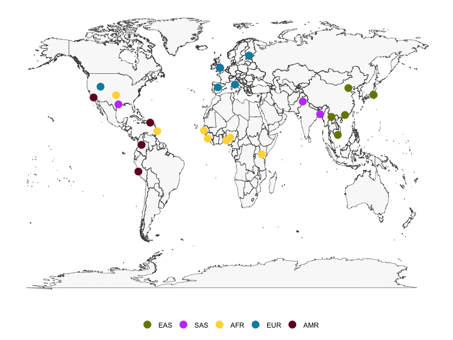
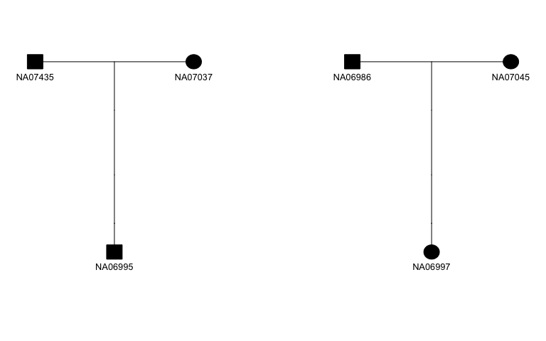

<!-- README.md is generated from README.Rmd. Please edit that file -->

# kgp

<!-- badges: start -->

[](https://CRAN.R-project.org/package=kgp)
[](https://lifecycle.r-lib.org/articles/stages.html#stable)
[](https://arxiv.org/abs/2210.00539)
<!-- badges: end -->

This kgp data package provides metadata about populations and data about
samples from the 1000 Genomes Project, including the 2,504 samples
sequenced for the Phase 3 release and the expanded collection of 3,202
samples with 602 additional trios.

## Installation

You can install the released version of kgp from
[CRAN](https://CRAN.R-project.org/package=kgp) with:

``` r
install.packages("kgp")
```

You can install the development version of kgp from
[GitHub](https://github.com/stephenturner/kgp) with:

``` r
# install.packages("devtools")
devtools::install_github("stephenturner/kgp")
```

## About the data

The 1000 Genomes Project data Phase 3 data contains 2,504 samples with
sequence data available, and was later expanded to 3,202 samples with
high coverage adding 602 trios. Data is available through the [1000
Genomes FTP site](http://ftp.1000genomes.ebi.ac.uk/vol1/ftp/) and
[GitHub](https://github.com/igsr/1000Genomes_data_indexes/).

-   Pilot publication: [An integrated map of genetic variation from
    1,092 human genomes](https://www.nature.com/articles/nature11632)
-   Phase 1 publication: [A map of human genome variation from
    population scale
    sequencing](https://www.nature.com/articles/nature09534)
-   Phase 3 publication: [A global reference for human genetic
    variation](https://www.nature.com/articles/nature15393)
-   Expanded high-coverage publication: [High-coverage whole-genome
    sequencing of the expanded 1000 Genomes Project cohort including 602
    trios](https://pubmed.ncbi.nlm.nih.gov/36055201/)

There are three data sets available in the kgp package.

``` r
library(kgp)
data(kgp)
```

The `kgp3` data contains pedigree and population information for the
2,504 samples included in the Phase 3 release of the 1000 Genomes
Project data.

``` r
kgp3
#> # A tibble: 2,504 × 10
#>    fid     id      pid   mid     sex sexf   pop   reg   population        region
#>    <chr>   <chr>   <chr> <chr> <int> <fct>  <chr> <chr> <chr>             <chr> 
#>  1 HG00096 HG00096 0     0         1 male   GBR   EUR   British in Engla… Europe
#>  2 HG00097 HG00097 0     0         2 female GBR   EUR   British in Engla… Europe
#>  3 HG00099 HG00099 0     0         2 female GBR   EUR   British in Engla… Europe
#>  4 HG00100 HG00100 0     0         2 female GBR   EUR   British in Engla… Europe
#>  5 HG00101 HG00101 0     0         1 male   GBR   EUR   British in Engla… Europe
#>  6 HG00102 HG00102 0     0         2 female GBR   EUR   British in Engla… Europe
#>  7 HG00103 HG00103 0     0         1 male   GBR   EUR   British in Engla… Europe
#>  8 HG00105 HG00105 0     0         1 male   GBR   EUR   British in Engla… Europe
#>  9 HG00106 HG00106 0     0         2 female GBR   EUR   British in Engla… Europe
#> 10 HG00107 HG00107 0     0         1 male   GBR   EUR   British in Engla… Europe
#> # … with 2,494 more rows
#> # ℹ Use `print(n = ...)` to see more rows
```

The `kgpe` data contains pedigree and population information all 3,202
samples included in the expanded 1000 Genomes Project data, which
includes 602 trios.

``` r
kgpe
#> # A tibble: 3,202 × 11
#>    fid     id      pid   mid     sex sexf   pop   reg   population region phase3
#>    <chr>   <chr>   <chr> <chr> <int> <fct>  <chr> <chr> <chr>      <chr>  <lgl> 
#>  1 HG00096 HG00096 0     0         1 male   GBR   EUR   British i… Europe TRUE  
#>  2 HG00097 HG00097 0     0         2 female GBR   EUR   British i… Europe TRUE  
#>  3 HG00099 HG00099 0     0         2 female GBR   EUR   British i… Europe TRUE  
#>  4 HG00100 HG00100 0     0         2 female GBR   EUR   British i… Europe TRUE  
#>  5 HG00101 HG00101 0     0         1 male   GBR   EUR   British i… Europe TRUE  
#>  6 HG00102 HG00102 0     0         2 female GBR   EUR   British i… Europe TRUE  
#>  7 HG00103 HG00103 0     0         1 male   GBR   EUR   British i… Europe TRUE  
#>  8 HG00105 HG00105 0     0         1 male   GBR   EUR   British i… Europe TRUE  
#>  9 HG00106 HG00106 0     0         2 female GBR   EUR   British i… Europe TRUE  
#> 10 HG00107 HG00107 0     0         1 male   GBR   EUR   British i… Europe TRUE  
#> # … with 3,192 more rows
#> # ℹ Use `print(n = ...)` to see more rows
```

The `kgpmeta` contains population metadata for the 26 populations across
five continental regions.

``` r
kgpmeta
#> # A tibble: 26 × 7
#>    pop   population                          reg   region   regco…¹   lat    lng
#>    <chr> <chr>                               <chr> <chr>    <chr>   <dbl>  <dbl>
#>  1 CDX   Chinese Dai in Xishuangbanna, China EAS   East As… #778500  22   101.  
#>  2 CHB   Han Chinese in Bejing, China        EAS   East As… #778500  39.9 116.  
#>  3 JPT   Japanese in Tokyo, Japan            EAS   East As… #778500  35.7 140.  
#>  4 KHV   Kinh in Ho Chi Minh City, Vietnam   EAS   East As… #778500  10.8 107.  
#>  5 CHS   Southern Han Chinese, China         EAS   East As… #778500  23.1 113.  
#>  6 BEB   Bengali in Bangladesh               SAS   South A… #c44cfd  23.7  90.4 
#>  7 GIH   Gujarati Indian in Houston,TX       SAS   South A… #c44cfd  29.8 -95.4 
#>  8 ITU   Indian Telugu in the UK             SAS   South A… #c44cfd  52.5  -1.89
#>  9 PJL   Punjabi in Lahore,Pakistan          SAS   South A… #c44cfd  31.6  74.4 
#> 10 STU   Sri Lankan Tamil in the UK          SAS   South A… #c44cfd  52.5  -1.89
#> # … with 16 more rows, and abbreviated variable name ¹​regcolor
#> # ℹ Use `print(n = ...)` to see more rows
```

## Examples

``` r
library(dplyr)
library(ggplot2)
library(kgp)
data(kgp)
```

Count the number of samples in each region, or in each population:

``` r
kgp3 %>% 
  count(region) %>% 
  knitr::kable()
```

| region     |   n |
|:-----------|----:|
| Africa     | 661 |
| America    | 347 |
| East Asia  | 504 |
| Europe     | 503 |
| South Asia | 489 |

``` r
kgp3 %>% 
  count(region, population) %>% 
  knitr::kable()
```

| region     | population                                                 |   n |
|:-----------|:-----------------------------------------------------------|----:|
| Africa     | African Ancestry in Southwest US                           |  61 |
| Africa     | African Caribbean in Barbados                              |  96 |
| Africa     | Esan in Nigeria                                            |  99 |
| Africa     | Gambian in Western Division, The Gambia                    | 113 |
| Africa     | Luhya in Webuye, Kenya                                     |  99 |
| Africa     | Mende in Sierra Leone                                      |  85 |
| Africa     | Yoruba in Ibadan, Nigeria                                  | 108 |
| America    | Colombian in Medellin, Colombia                            |  94 |
| America    | Mexican Ancestry in Los Angeles, California                |  64 |
| America    | Peruvian in Lima, Peru                                     |  85 |
| America    | Puerto Rican in Puerto Rico                                | 104 |
| East Asia  | Chinese Dai in Xishuangbanna, China                        |  93 |
| East Asia  | Han Chinese in Bejing, China                               | 103 |
| East Asia  | Japanese in Tokyo, Japan                                   | 104 |
| East Asia  | Kinh in Ho Chi Minh City, Vietnam                          |  99 |
| East Asia  | Southern Han Chinese, China                                | 105 |
| Europe     | British in England and Scotland                            |  91 |
| Europe     | Finnish in Finland                                         |  99 |
| Europe     | Iberian populations in Spain                               | 107 |
| Europe     | Toscani in Italy                                           | 107 |
| Europe     | Utah residents with Northern and Western European ancestry |  99 |
| South Asia | Bengali in Bangladesh                                      |  86 |
| South Asia | Gujarati Indian in Houston,TX                              | 103 |
| South Asia | Indian Telugu in the UK                                    | 102 |
| South Asia | Punjabi in Lahore,Pakistan                                 |  96 |
| South Asia | Sri Lankan Tamil in the UK                                 | 102 |

``` r
kgp3 %>% 
  count(region, population) %>% 
  arrange(region, n) %>% 
  mutate(population=forcats::fct_inorder(population)) %>% 
  ggplot(aes(population, n)) + 
  geom_col(aes(fill=region)) + 
  labs(fill=NULL, x=NULL, x="N") + 
  coord_flip() + 
  theme_bw() + 
  theme(legend.position="bottom")
```


The latitude and longitude coordinates in `kgpmeta` can be used to plot
a map of the locations of the 1000 Genomes populations. There is also a
column for region color, which provides a hexadecimal color code to
enable reproduction of the population data map as shown on the IGSR
population data page. The figure below shows a static map produced using
ggplot2, but interactive maps such as that shown on the IGSR population
data portal can be created with the leaflet package.

``` r
pal <- kgpmeta %>% distinct(reg, regcolor) %>% tibble::deframe()
ggplot() + 
  geom_polygon(data=map_data("world"), 
               aes(long, lat, group=group), 
               col="gray30", fill="gray95", lwd=.2, alpha=.5) + 
  geom_point(data=kgpmeta, aes(lng, lat, col=reg), size=4) + 
  scale_colour_manual(values=pal) +
  theme_minimal() + 
  theme(axis.ticks = element_blank(), 
        axis.text = element_blank(), 
        axis.title = element_blank(), 
        legend.title = element_blank(),
        panel.grid = element_blank(),
        legend.position = "bottom")
```



The table below shows a selection of samples from `kgpe` showing
pedigree information for each sample. This pedigree information could be
used in downstream analysis to filter out related individuals, select
only trios, or to visualize family structure.

``` r
kgpe %>% 
  filter(pid!="0" & mid!="0") %>% 
  group_by(pop) %>% 
  slice(1) %>% 
  head(12) %>% 
  arrange(reg, pop) %>% 
  select(fid:reg) %>% 
  select(-sexf) %>% 
  knitr::kable()
```

| fid    | id      | pid     | mid     | sex | pop | reg |
|:-------|:--------|:--------|:--------|----:|:----|:----|
| BB01   | HG01881 | HG01879 | HG01880 |   2 | ACB | AFR |
| 2367   | NA19702 | NA19700 | NA19701 |   1 | ASW | AFR |
| NG06   | HG02924 | HG02923 | HG02922 |   1 | ESN | AFR |
| GB15   | HG02463 | HG02461 | HG02462 |   1 | GWD | AFR |
| SL02   | HG03056 | HG03054 | HG03055 |   1 | MSL | AFR |
| CLM03  | HG01114 | HG01112 | HG01113 |   2 | CLM | AMR |
| SH001  | HG00405 | HG00403 | HG00404 |   2 | CHS | EAS |
| VN046  | HG02015 | HG02017 | HG02016 |   1 | KHV | EAS |
| 1341   | NA06991 | NA06993 | NA06985 |   2 | CEU | EUR |
| IBS001 | HG01502 | HG01500 | HG01501 |   1 | IBS | EUR |
| BD01   | HG03008 | HG03006 | HG03007 |   1 | BEB | SAS |
| IT002  | HG03719 | HG03725 | HG03722 |   2 | ITU | SAS |

The figure below shows an example of a pedigree plot made by parsing the
pedigree information using
[skater](https://cran.r-project.org/package=skater) and plotting using
[kinship2](https://cran.r-project.org/package=kinship2). The skater
package provides documentation, examples, and a vignette demonstrating
how to iteratively plot all pedigrees in a given data set.

``` r
kgpe %>% 
  filter(fid=="13291") %>% 
  transmute(fid, id, dadid=pid, momid=mid, sex, affected=1) %>% 
  skater::fam2ped() %>% 
  pull(ped) %>% 
  purrr::pluck(1) %>% 
  kinship2::plot.pedigree(mar=c(4,2,4,2), cex=.8)
```


