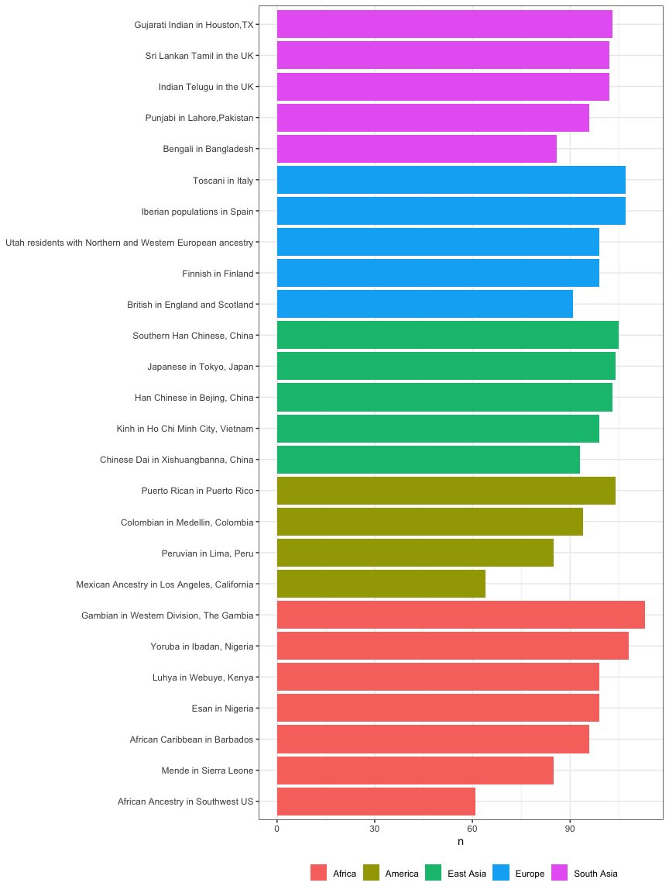

<!-- README.md is generated from README.Rmd. Please edit that file -->

# kgp

<!-- badges: start -->

[](https://CRAN.R-project.org/package=kgp)
<!-- badges: end -->

This kgp data package provides metadata about populations and data about
samples from the 1000 Genomes Project, including the 2,504 samples
sequenced for the Phase 3 release and the expanded collection of 3,202
samples with 602 additional trios.

## Installation

You can install the released version of kgp from
[CRAN](https://CRAN.R-project.org/package=kgp) with:

``` r
install.packages("kgp")
```

You can install the development version of kgp from
[GitHub](https://github.com/stephenturner/kgp) with:

``` r
# install.packages("devtools")
devtools::install_github("stephenturner/kgp")
```

## About the data

The 1000 Genomes Project data Phase 3 data contains 2,504 samples with
sequence data available, and was later expanded to 3,202 samples with
high coverage adding 602 trios. Data is available through the [1000
Genomes FTP site](http://ftp.1000genomes.ebi.ac.uk/vol1/ftp/) and
[GitHub](https://github.com/igsr/1000Genomes_data_indexes/).

-   Pilot publication: [An integrated map of genetic variation from
    1,092 human genomes](https://www.nature.com/articles/nature11632)
-   Phase 1 publication: [A map of human genome variation from
    population scale
    sequencing](https://www.nature.com/articles/nature09534)
-   Phase 3 publication: [A global reference for human genetic
    variation](https://www.nature.com/articles/nature15393)
-   Expanded high-coverage publication: [High-coverage whole-genome
    sequencing of the expanded 1000 Genomes Project cohort including 602
    trios](https://pubmed.ncbi.nlm.nih.gov/36055201/)

There are three data sets available in the kgp package.

``` r
library(kgp)
data(kgp)
```

The `kgp3` data contains pedigree and population information for the
2,504 samples included in the Phase 3 release of the 1000 Genomes
Project data.

``` r
kgp3
#> # A tibble: 2,504 × 10
#>    fid     id      pid   mid     sex sexf   pop   reg   population        region
#>    <chr>   <chr>   <chr> <chr> <int> <fct>  <chr> <chr> <chr>             <chr> 
#>  1 HG00096 HG00096 0     0         1 male   GBR   EUR   British in Engla… Europ…
#>  2 HG00097 HG00097 0     0         2 female GBR   EUR   British in Engla… Europ…
#>  3 HG00099 HG00099 0     0         2 female GBR   EUR   British in Engla… Europ…
#>  4 HG00100 HG00100 0     0         2 female GBR   EUR   British in Engla… Europ…
#>  5 HG00101 HG00101 0     0         1 male   GBR   EUR   British in Engla… Europ…
#>  6 HG00102 HG00102 0     0         2 female GBR   EUR   British in Engla… Europ…
#>  7 HG00103 HG00103 0     0         1 male   GBR   EUR   British in Engla… Europ…
#>  8 HG00105 HG00105 0     0         1 male   GBR   EUR   British in Engla… Europ…
#>  9 HG00106 HG00106 0     0         2 female GBR   EUR   British in Engla… Europ…
#> 10 HG00107 HG00107 0     0         1 male   GBR   EUR   British in Engla… Europ…
#> # … with 2,494 more rows
#> # ℹ Use `print(n = ...)` to see more rows
```

The `kgpe` data contains pedigree and population information all 3,202
samples included in the expanded 1000 Genomes Project data, which
includes 602 trios.

``` r
kgpe
#> # A tibble: 3,202 × 11
#>    fid     id      pid   mid     sex sexf   pop   reg   population region phase3
#>    <chr>   <chr>   <chr> <chr> <int> <fct>  <chr> <chr> <chr>      <chr>  <lgl> 
#>  1 HG00096 HG00096 0     0         1 male   GBR   EUR   British i… Europ… TRUE  
#>  2 HG00097 HG00097 0     0         2 female GBR   EUR   British i… Europ… TRUE  
#>  3 HG00099 HG00099 0     0         2 female GBR   EUR   British i… Europ… TRUE  
#>  4 HG00100 HG00100 0     0         2 female GBR   EUR   British i… Europ… TRUE  
#>  5 HG00101 HG00101 0     0         1 male   GBR   EUR   British i… Europ… TRUE  
#>  6 HG00102 HG00102 0     0         2 female GBR   EUR   British i… Europ… TRUE  
#>  7 HG00103 HG00103 0     0         1 male   GBR   EUR   British i… Europ… TRUE  
#>  8 HG00105 HG00105 0     0         1 male   GBR   EUR   British i… Europ… TRUE  
#>  9 HG00106 HG00106 0     0         2 female GBR   EUR   British i… Europ… TRUE  
#> 10 HG00107 HG00107 0     0         1 male   GBR   EUR   British i… Europ… TRUE  
#> # … with 3,192 more rows
#> # ℹ Use `print(n = ...)` to see more rows
```

The `kgpmeta` contains population metadata for the 26 populations across
five continental regions.

``` r
kgpmeta
#> # A tibble: 26 × 4
#>    pop   population                          reg   region     
#>    <chr> <chr>                               <chr> <chr>      
#>  1 CDX   Chinese Dai in Xishuangbanna, China EAS   East Asian 
#>  2 CHB   Han Chinese in Bejing, China        EAS   East Asian 
#>  3 JPT   Japanese in Tokyo, Japan            EAS   East Asian 
#>  4 KHV   Kinh in Ho Chi Minh City, Vietnam   EAS   East Asian 
#>  5 CHS   Southern Han Chinese, China         EAS   East Asian 
#>  6 BEB   Bengali in Bangladesh               SAS   South Asian
#>  7 GIH   Gujarati Indian in Houston,TX       SAS   South Asian
#>  8 ITU   Indian Telugu in the UK             SAS   South Asian
#>  9 PJL   Punjabi in Lahore,Pakistan          SAS   South Asian
#> 10 STU   Sri Lankan Tamil in the UK          SAS   South Asian
#> # … with 16 more rows
#> # ℹ Use `print(n = ...)` to see more rows
```

## Examples

``` r
library(dplyr)
library(ggplot2)
library(kgp)
data(kgp)
```

``` r
kgp3 %>% 
  count(region)
#> # A tibble: 5 × 2
#>   region          n
#>   <chr>       <int>
#> 1 African       661
#> 2 American      347
#> 3 East Asian    504
#> 4 European      503
#> 5 South Asian   489
```

``` r
kgp3 %>% 
  count(region, population)
#> # A tibble: 26 × 3
#>    region   population                                      n
#>    <chr>    <chr>                                       <int>
#>  1 African  African Ancestry in Southwest US               61
#>  2 African  African Caribbean in Barbados                  96
#>  3 African  Esan in Nigeria                                99
#>  4 African  Gambian in Western Division, The Gambia       113
#>  5 African  Luhya in Webuye, Kenya                         99
#>  6 African  Mende in Sierra Leone                          85
#>  7 African  Yoruba in Ibadan, Nigeria                     108
#>  8 American Colombian in Medellin, Colombia                94
#>  9 American Mexican Ancestry in Los Angeles, California    64
#> 10 American Peruvian in Lima, Peru                         85
#> # … with 16 more rows
#> # ℹ Use `print(n = ...)` to see more rows
```

``` r
kgp3 %>% 
  count(region, population) %>% 
  arrange(region, n) %>% 
  mutate(population=forcats::fct_inorder(population)) %>% 
  ggplot(aes(population, n)) + 
  geom_col(aes(fill=region)) + 
  labs(fill=NULL, x=NULL, x="N") + 
  coord_flip() + 
  theme_bw() + 
  theme(legend.position="bottom")
```


